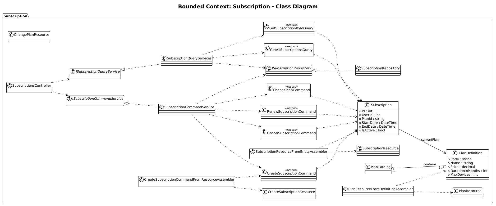
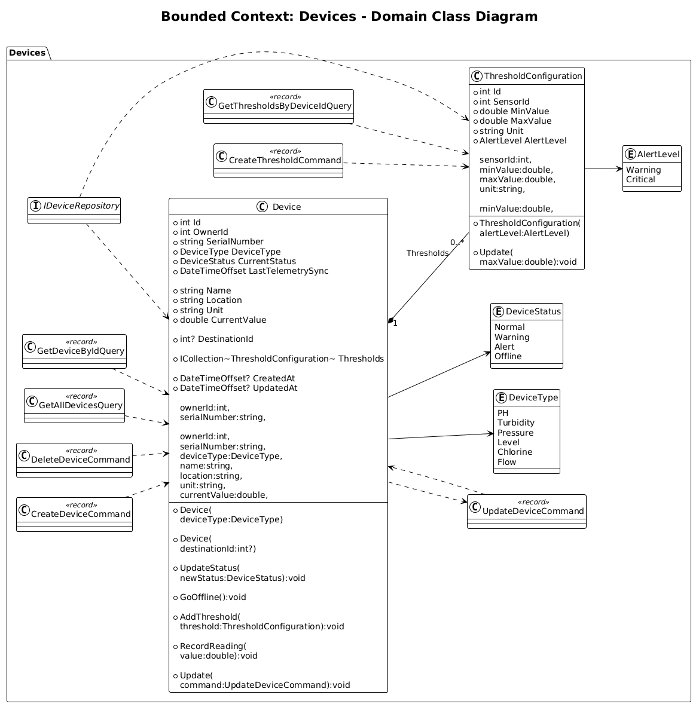
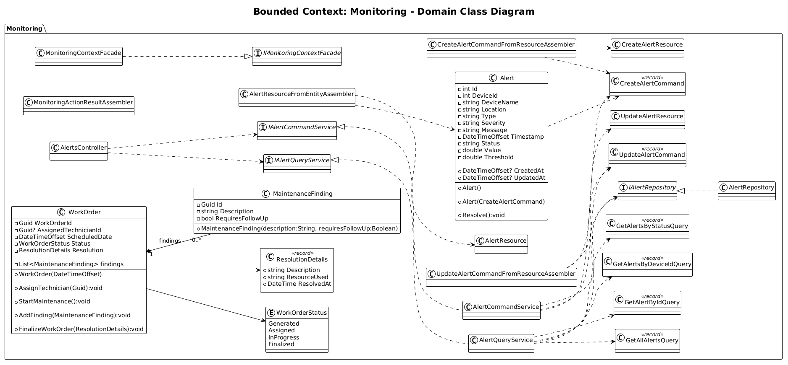
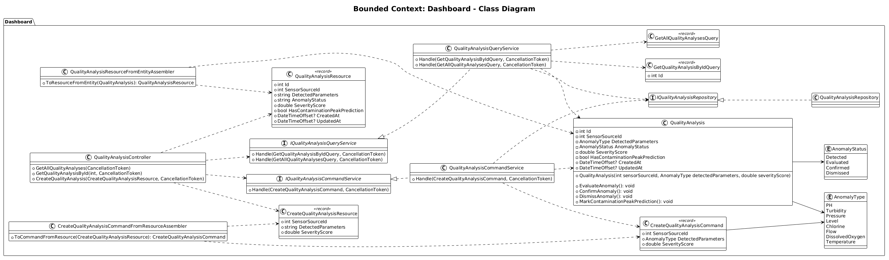
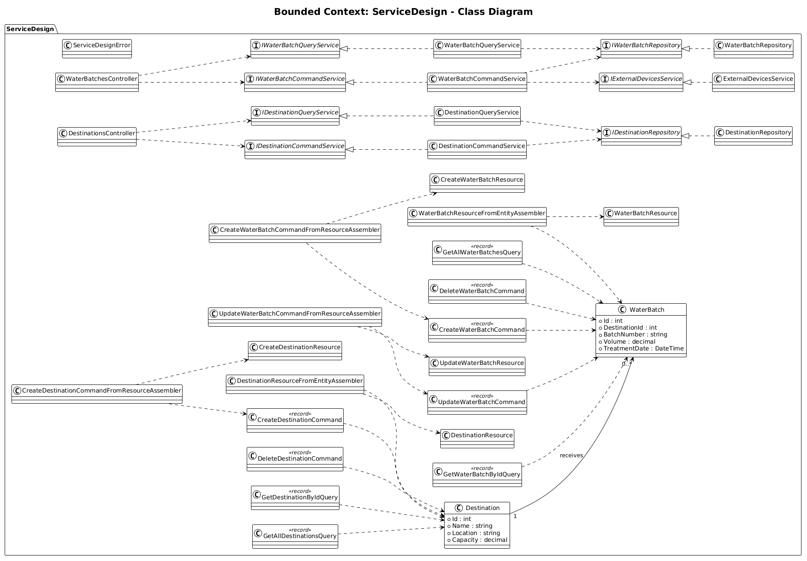

### 4.7. Software Object-Oriented Design

El desarrollo estructural de nuestra plataforma se fundamenta estrictamente en el paradigma orientado a objetos, diseñado en C# siguiendo los principios de Domain-Driven Design (DDD). Esta decisión metodológica nos brinda la capacidad de segmentar los distintos procesos del negocio hídrico en *Bounded Contexts* independientes, garantizando una alta cohesión y un bajo acoplamiento que facilitará la expansión futura sin fricciones. A través de la correcta aplicación del encapsulamiento para proteger la información corporativa, sumado a la herencia y el polimorfismo para jerarquizar nuestras entidades de monitoreo, diseñamos componentes de software robustos y escalables.

A continuación, se presentan los diagramas de clases UML y el diccionario de datos correspondiente a la implementación de cada *Bounded Context* identificado en nuestra arquitectura.

### 4.7.1. Class Diagrams

#### 1. Bounded Context: Subscription
Este contexto se encarga de gestionar a las empresas clientes y el control de acceso a los distintos niveles de servicio de la plataforma.

  

**Explicación y Diccionario de Clases:**
*   **Clase `Enterprise` (Aggregate Root):** Representa a las organizaciones registradas (EPS, Operadores de Residuos).
    *   *Atributos:* `- Id : int`, `- Name : string`, `- TaxId_RUC : string`
    *   *Métodos:* `+ CalculateFootprint() : decimal`, `+ UpgradePlan(newPlan: SubscriptionPlan) : void`
*   **Clase `SubscriptionPlan`:** Define los planes comerciales que determinan los límites operativos y costos.
    *   *Atributos:* `- Id : int`, `- Name : string`, `- MonthlyCost : decimal`, `- MaxSensors : int`
    *   *Métodos:* `+ VerifyLimit(currentSensors: int) : bool`

#### 2. Bounded Context: Devices
Este contexto maneja la configuración, registro y estado del hardware IoT desplegado en la infraestructura hídrica.

  

**Explicación y Diccionario de Clases:**
*   **Clase `Sensor` (Aggregate Root):** Representa los dispositivos físicos instalados en campo (pozas, tuberías).
    *   *Atributos:* `- Id : int`, `- Location : string`, `- IsActive : bool`, `- Type : SensorType`
    *   *Métodos:* `+ RecordData(value: decimal) : void`, `- TriggerAlert(severity: AlertSeverity) : void` (Privado por seguridad de la entidad).
*   **Enumeración `SensorType`:** Clasifica el hardware IoT.
    *   *Valores:* `Ultrasonic`, `Flow`, `Turbidity`.

#### 3. Bounded Context: Monitoring
Este contexto encapsula la lógica de telemetría en tiempo real y el motor de alertas automáticas del sistema.

  

**Explicación y Diccionario de Clases:**
*   **Clase `Alert` (Aggregate Root):** Almacena los eventos anómalos o críticos detectados que requieren atención operativa.
    *   *Atributos:* `- Id : int`, `- Message : string`, `- Severity : AlertSeverity`, `- IsResolved : bool`
    *   *Métodos:* `+ ResolveAlert(userId: int) : void`
*   **Interfaz `IAlertNotifier`:** Contrato para servicios externos encargados de enviar notificaciones push o SMS.
    *   *Métodos:* `+ SendNotification(alertId: int, email: string) : bool`, `+ RegisterDeviceToken(token: string) : void`
*   **Enumeración `AlertSeverity`:**
    *   *Valores:* `Low`, `Medium`, `Critical`.

#### 4. Bounded Context: Dashboard
Este contexto se enfoca en la consolidación, analítica y visualización de datos masivos para la toma de decisiones gerenciales.

  

**Explicación y Diccionario de Clases:**
*   **Clase `TelemetryData`:** Almacena el historial continuo de lecturas enviadas por los sensores. Diseñada para alto volumen transaccional.
    *   *Atributos:* `- Id : long`, `- Value : decimal`, `- Timestamp : DateTime`
    *   *Métodos:* `+ ExportToCsv() : string`

#### 5. Bounded Context: Service Design
Este contexto administra la identidad de los operadores, perfiles técnicos y el registro logístico del recurso hídrico recuperado o consumido.

  

**Explicación y Diccionario de Clases:**
*   **Clase `User` (Aggregate Root):** Actores que interactúan con el sistema (Ingenieros, Auditores).
    *   *Atributos:* `- Id : int`, `- FullName : string`, `- Email : string`, `- PasswordHash : string`, `- UserRole : Role`
    *   *Métodos:* `+ Authenticate(password: string) : bool`, `# UpdateLastLogin() : void` (Protegido).
*   **Clase `WaterLog`:** Entidad encargada de registrar los ingresos/egresos de agua para el control de la huella hídrica y la sostenibilidad.
    *   *Atributos:* `- Id : int`, `- VolumeLiters : decimal`, `- TotalCost : decimal`, `- Source : string`
    *   *Métodos:* `+ CalculateCostPerLiter() : decimal`
*   **Enumeración `Role`:** Define los niveles de acceso.
    *   *Valores:* `Admin`, `Engineer`, `Auditor`.
