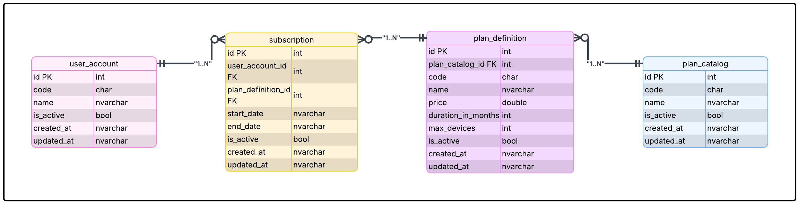
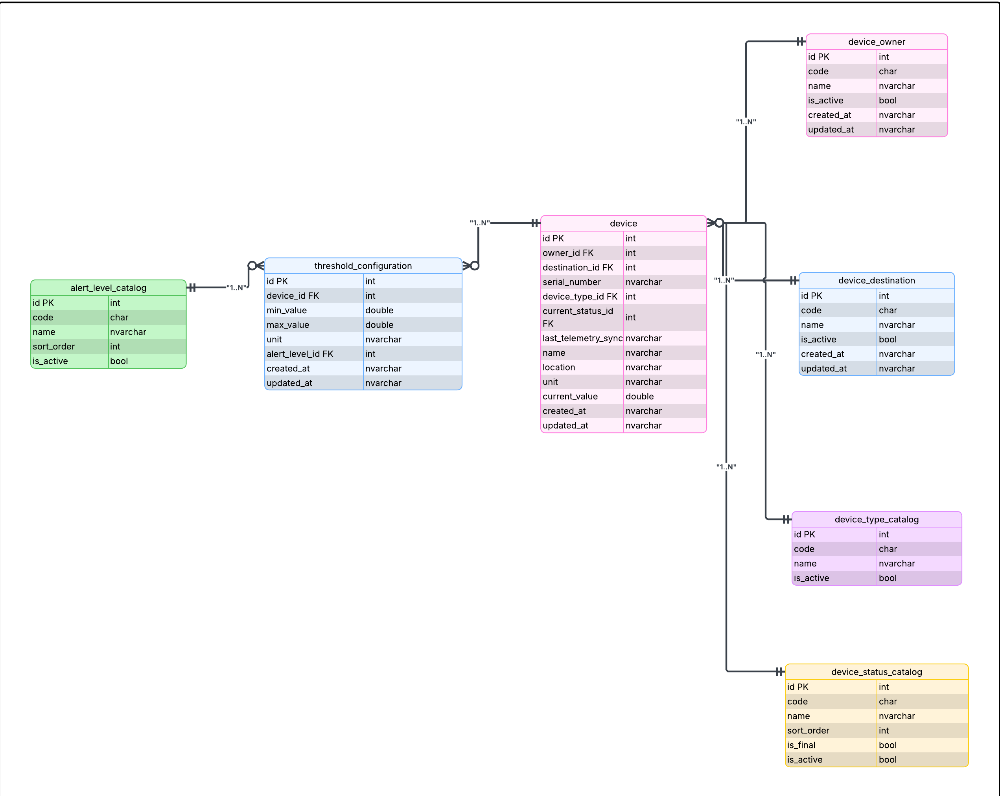
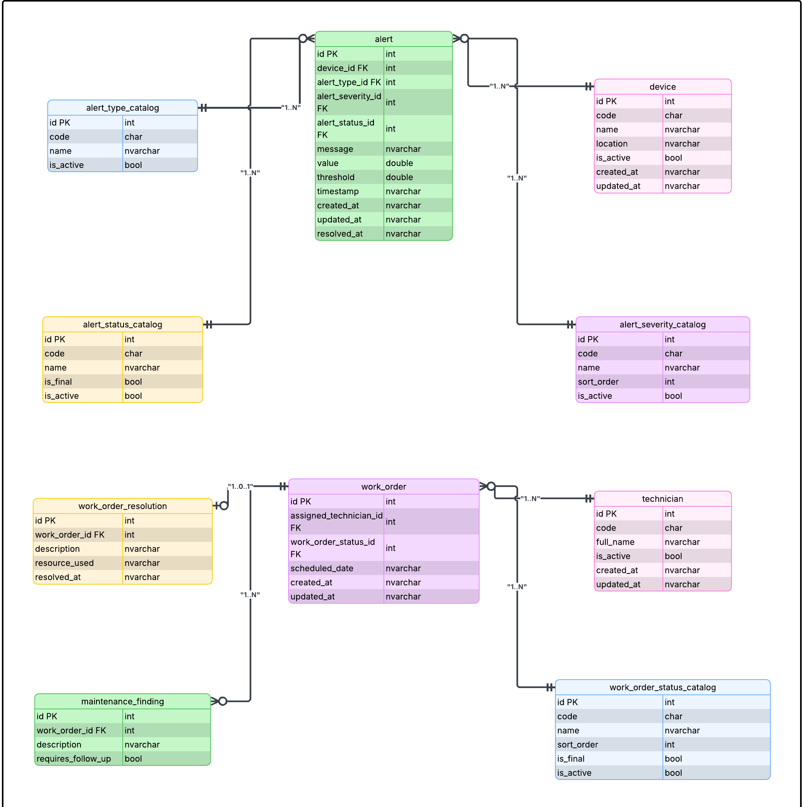
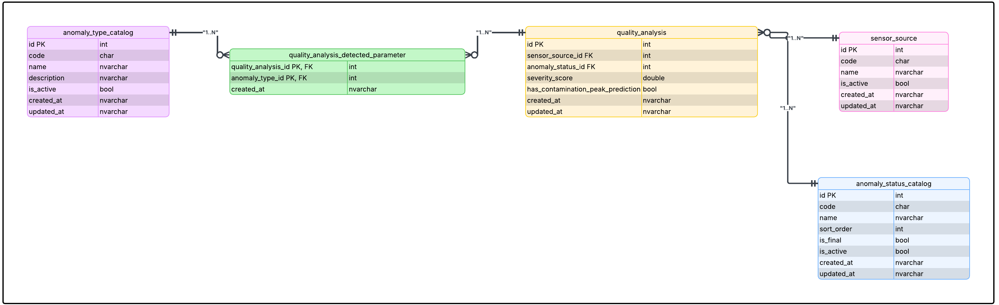
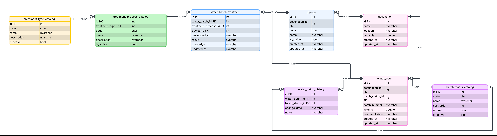

## 4.8. Database Design

En esta sección se presenta el diseño de la base de datos de Aquanetix, el cual resulta vital para establecer la base estructural necesaria que resguardará grandes volúmenes de telemetría y registros de consumo hídrico de manera segura[cite: 1]. Se resumen a continuación las principales características consideradas en los diagramas: el modelado relacional sigue un enfoque de normalización para evitar redundancias, asegurando la integridad de los datos mediante el uso estricto de restricciones (*constraints*) como llaves primarias y foráneas. Esta organización estructurada y segmentada por *Bounded Contexts* garantizará una consulta veloz y eficiente para los reportes ambientales que requieran los auditores o ingenieros del sistema.

### 4.8.1. Database Diagrams

A continuación, se presenta y explica el diagrama de base de datos relacional para cada *Bounded Context*, incluyendo los objetos que permitirán la persistencia de la información, sus tablas, columnas, restricciones (*constraints*) y las relaciones evidenciadas[cite: 1].

#### 1. Bounded Context: Subscription
Este diagrama define la persistencia de los planes comerciales y las suscripciones de los clientes.

**Explicación del esquema:**
*   **Tablas:** `Subscriptions` y `PlanDefinitions`.
*   **Columnas principales:** `Id`, `StartDate`, `EndDate` y `IsActive` en suscripciones; `Code`, `Name`, `Price` y `MaxDevices` en los planes.
*   **Constraints y Relaciones:** La tabla `Subscriptions` posee una llave primaria (`PK`) en su campo `Id`. Se evidencia una relación de uno a muchos mediante la llave foránea (`FK`) `PlanId` en la tabla `Subscriptions`, la cual referencia a la llave primaria de la tabla `PlanDefinitions`. Esto asegura que una suscripción no pueda existir sin estar atada a un plan válido en el catálogo.

#### 2. Bounded Context: Devices
Este diagrama estructura el almacenamiento del inventario de sensores IoT y sus configuraciones de umbrales.

**Explicación del esquema:**
*   **Tablas:** `Devices` y `ThresholdConfigurations`.
*   **Columnas principales:** `Id`, `SerialNumber`, `DeviceType`, `CurrentValue` y `Location` para los dispositivos; `MinValue`, `MaxValue` y `AlertLevel` para los umbrales.
*   **Constraints y Relaciones:** Ambas tablas definen su `Id` como llave primaria (`PK`). La tabla `ThresholdConfigurations` incluye una llave foránea (`FK`) llamada `SensorId` que apunta a `Devices`. Esto ilustra una relación de uno a muchos, permitiendo que un solo dispositivo físico posea múltiples configuraciones de umbrales activos sin violar la integridad referencial.

#### 3. Bounded Context: Monitoring
Este diagrama detalla la persistencia del motor de alertas y la gestión de órdenes de mantenimiento operativo.

**Explicación del esquema:**
*   **Tablas:** `Alerts`, `WorkOrders` y `MaintenanceFindings`.
*   **Columnas principales:** `Id`, `Severity`, `Message` en alertas; `WorkOrderId` (tipo `Guid`), `ScheduledDate` y `Status` en órdenes de trabajo; `Description` y `RequiresFollowUp` en hallazgos.
*   **Constraints y Relaciones:** Cada tabla cuenta con su respectiva llave primaria (`PK`). Existe una relación de uno a muchos entre `WorkOrders` y `MaintenanceFindings`, materializada a través de una llave foránea (`FK`) en la tabla de hallazgos que referencia al identificador único de la orden de trabajo, garantizando la trazabilidad de qué problemas se encontraron durante qué mantenimiento específico.

#### 4. Bounded Context: Dashboard
Este diagrama modela la base para la analítica de la calidad del agua.

**Explicación del esquema:**
*   **Tablas:** `QualityAnalyses`.
*   **Columnas principales:** `Id`, `SensorSourceId`, `DetectedParameters`, `AnomalyStatus`, `SeverityScore` y `HasContaminationPeakPrediction`.
*   **Constraints y Relaciones:** La tabla está definida por su llave primaria (`PK`) `Id`. Al ser un contexto enfocado en la consolidación analítica, actúa principalmente persistiendo los registros históricos de evaluaciones de contaminación mediante tipos de datos específicos (como `double` para el score de severidad), lo que facilita su lectura rápida para los dashboards gerenciales.

#### 5. Bounded Context: Service Design
Este diagrama traza el movimiento logístico del agua recuperada y tratada hacia sus destinos operativos.

**Explicación del esquema:**
*   **Tablas:** `WaterBatches` y `Destinations`.
*   **Columnas principales:** `Id`, `BatchNumber`, `Volume` y `TreatmentDate` para los lotes; `Id`, `Name`, `Location` y `Capacity` para los destinos.
*   **Constraints y Relaciones:** Se definen llaves primarias (`PK`) en ambas tablas. La trazabilidad logística se asegura mediante una llave foránea (`FK`) `DestinationId` en la tabla `WaterBatches` que apunta a `Destinations`. Esto crea una relación de uno a muchos que refleja cómo un único punto de destino puede recibir múltiples lotes de agua reutilizable a lo largo del tiempo.
